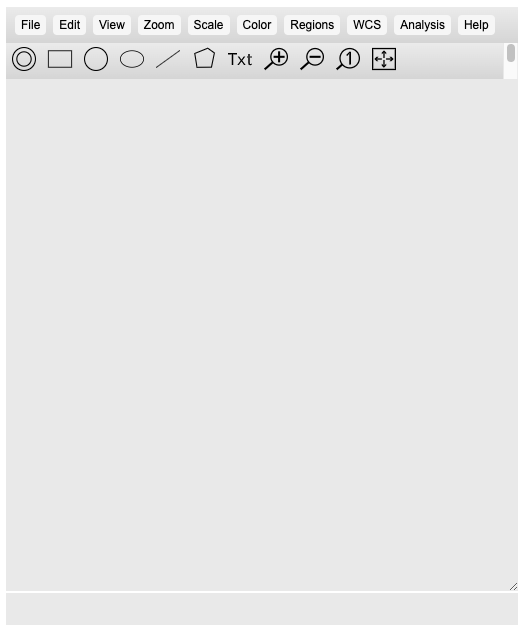
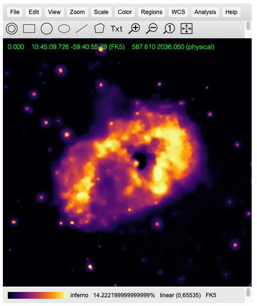

# js9-fileviewer
js9 FITS format file viewer

### Example build and run
```
docker build -t wtstephens/js9docker:0.0.2 .

docker run -p 8080:8080 -p 443:2718 wtstephens/js9docker:0.0.2
```
And then opening `localhost:8080/` in the browser.

Selecting "File", then "open remote...", then entering the following URL

https://chandra.harvard.edu/photo/2014/etacar/fits/etaCar_xray_low.fits

will load a sample FITS image.

-----

## Deployment to Sterling

In the `deployment` folder are instructions on how the js9 viewer is deployed to the argus and argus-dev namespaces on the RENCI Sterling cluster.

### CLI Query and Control

A deployment can be queried and controlled thru its "html" transport (versus its "socket.io" transport) using its `/msg` path.

Example:
```
~ $ wget -q -O- 'https://js9fileviewer.apps.renci.org:443/msg?{"id": "JS9", "cmd": "GetColormap"}'
{"colormap":"standard","contrast":1,"bias":0.5}
~ $
~ $ wget -q -O- 'https://js9fileviewer.apps.renci.org:443/msg?{"id": "JS9", "cmd": "SetColormap", "args": ["red"]}'
OK
~ $
```

-----

## Sample JS9 screenshots

JS9 server home page:



Example image after selecting "zoom to fit" and the "inferno" colormap:


